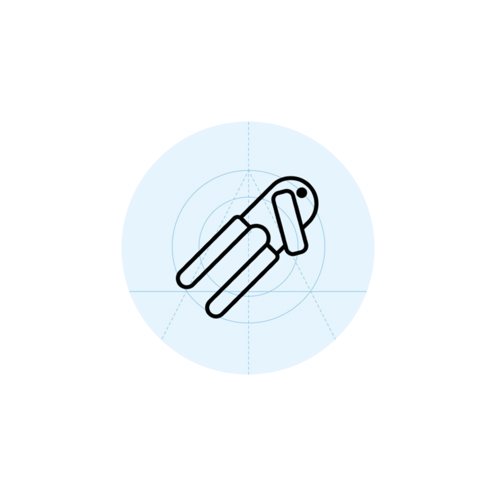
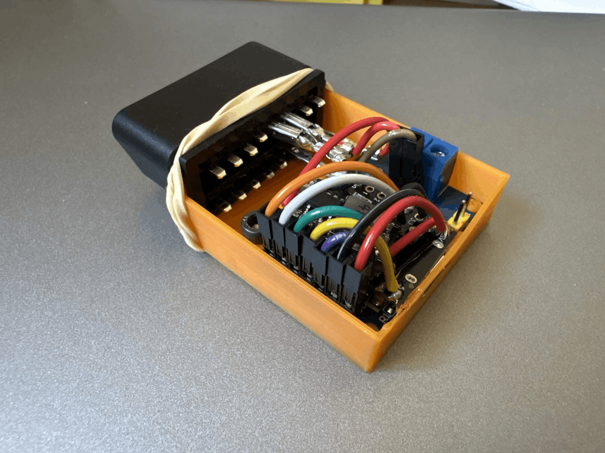
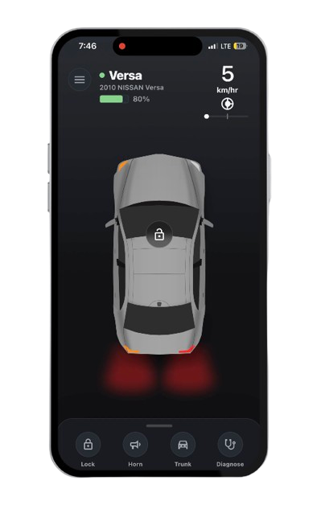
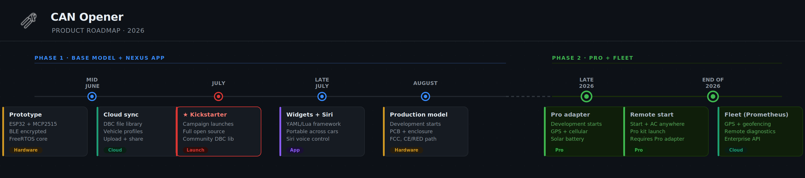

<div align="center">



# CAN Opener

**Turn any vehicle into a smart, connected system.**

Open-source vehicle intelligence platform — ESP32-based BLE hardware, a TypeScript signal library, and a polished mobile app for exploring, automating, and extending your car.

[Firmware](#firmware) · [can-opener-js](#can-opener-js) · [Nexus App](#nexus-app) · [BLE Interface](#ble-interface) · [Roadmap](#roadmap)

</div>

---

## What Is CAN Opener?

CAN Opener is an end-to-end open-source ecosystem for connected vehicle experiences. It bridges the physical CAN bus inside your car to a clean, developer-friendly software stack — without forcing you to speak raw hex.

The system has three main layers:

| Layer             | What It Does                                                                                                                                                                         |
| ----------------- | ------------------------------------------------------------------------------------------------------------------------------------------------------------------------------------ |
| **Firmware**      | ESP32 adapter that sits on the OBD-II port. Handles BLE pairing, CAN 500 kbps bus I/O, OBD-II PID responses, BCM requests, ISO-TP multi-frame reads, and monitor streaming.          |
| **can-opener-js** | TypeScript library that gives apps a virtual vehicle object. Abstracts DBC files, CAN IDs, byte layout, and signal packing behind named state like `ENGINE_RPM` and `VEHICLE_SPEED`. |
| **Nexus**         | React Native / Expo mobile app. Polished dashboard with live signal state, body controls, mock vehicles, and dev tooling;  all powered by can-opener-js.                             |

---

## Hardware

<div align="center">
  
</div>

The base adapter is built around the **ESP32** (ESP32-CAM or compatible) paired with an **MCP2515** CAN controller over SPI. It plugs directly into the OBD-II port and communicates with the Nexus app over BLE.

**Hardware highlights:**

- HS-CAN via pins 14 and 6
- ESP32 based
- FreeRTOS task orchestration: CAN handling, BLE, logging, safety watchdogs
- ISO-TP multi-frame VIN reads with flow-control handshake
- CAN frame monitor streaming for passive signal subscriptions
- Loopback diagnostic mode for hardware validation
- Replay task for light/body signal simulation during development
- SLCAN Streaming through USB Serial

**Planned hardware features:**

- Dual CAN support: one fixed to OBD pins 6/14, plus one independently configurable CAN and LIN interface routable to other OBD pins.
- ESD protection and automotive-grade CAN transceivers
- Reverse polarity and fuse protection
- FCC Part 15, IC, and CE/RED certification path

---

## can-opener-js

React-style vehicle state for TypeScript apps. `can-opener-js` wraps the entire vehicle — DBC files, CAN IDs, bit layout, scaling, byte order, and BLE transport details — behind a clean signal API.

```ts
import { VirtualVehicleManager } from "can-opener-js";
import { MockTransport } from "can-opener-js/transport";

const vv = new VirtualVehicleManager();
const car = await vv.connect({
  id: "my-car",
  transport: new MockTransport(),
  profiles: [vehicleProfile],
});

// Subscribe to live signals
await car.subscribe("ENGINE_RPM");
await car.subscribe(["TURN_SIGNAL_LEFT", "HIGH_BEAMS"]);

// Read state
const speed = await car.query("VEHICLE_SPEED");
const rpm = car.state.engine_rpm;

// Send an action
await car.action("HORN");
```

**Core concepts:**

- **Profiles** — YAML files that define endpoints, queries, actions, monitor subscriptions, and DBC mappings. The library ships no hardcoded PIDs; loaded YAML + DBC files are the source of truth.
- **DBC** — decodes received CAN frames into named signals. Owns units, scaling, byte order, and enum tables.
- **Signals** — passive broadcast values decoded from monitor frames and subscribed by name.
- **Queries** — request/response PID or UDS reads (VIN, SPEED, RPM, etc.) via the BLE request characteristic.
- **Actions** — multi-step command flows (LOCK, UNLOCK, HORN, LEFT_SIGNAL) with optional response verification.
- **State** — each vehicle exposes a `valtio/vanilla`-backed `VehicleState` with snake_case property access and reactive subscriptions.
- **Multi-vehicle** — `VirtualVehicleManager` is global-free. Each connected vehicle has isolated state, DBC registry, controllers, and transport.

**Standard capability keywords:**

| Category | Keywords                                                                                                               |
| -------- | ---------------------------------------------------------------------------------------------------------------------- |
| Actions  | `UNLOCK` `LOCK` `LEFT_SIGNAL` `RIGHT_SIGNAL` `OPEN_TRUNK` `CLOSE_TRUNK` `HORN`                                         |
| Signals  | `SPEED` `RPM` `LEFT_SIGNAL` `RIGHT_SIGNAL` `BRAKE_LIGHTS` `FUEL_LEVEL` `TPS` `STEERING_ANGLE` `LOW_BEAMS` `HIGH_BEAMS` |
| PIDs     | `RPM` `SPEED` `ECT` `IAT` `MAP` `MAF` `TPS` `FUEL_LEVEL` `VIN` `MIL_STATUS` `ODOMETER` + more                          |

```sh
npm install can-opener-js
```

---

## Nexus App

<div align="center">
  
</div>

**CAN Opener Nexus** is the user-facing mobile app built with Expo and React Native. It sits on top of `can-opener-js` and turns raw vehicle state into a polished control surface.

- Vehicle-first dashboard: speed, battery/fuel, lock state, trunk state, and animated lighting
- Manage paired vehicles with nicknames, paint colors, and attached DBC/profile metadata
- Dev controls: locks, doors, brake lights, low/high beams, turn signals, body state
- Mock vehicle support for local development without hardware
- UI components stay isolated from transport and CAN details — all state lives in can-opener-js

**Tech stack:** Expo · Expo Router · React Native · React 19 · TypeScript · react-native-svg · Expo haptics/blur/gradients

**Get started:**

```bash
# Clone and initialize the local can-opener-js package
git submodule update --init --recursive
npm install ./packages/can-opener-js

# Install app dependencies
npm install

# Start the dev server
npm run start

# Run on device
npx expo run:android --device
npx expo run:ios --device
```

---

## BLE Interface

The firmware exposes three BLE characteristics: a **Request** characteristic for the phone to send commands and receive CAN responses, a **Monitor Control** characteristic to configure which CAN IDs the firmware watches, and a **Monitor Data** characteristic that streams the latest frame snapshot for every monitored ID as they arrive.

The transport layer is intentionally minimal — it connects, sends raw CAN requests, manages the monitor list, and receives frame snapshots. It has no knowledge of DBC files, signal names, or application logic. That contract is stable and version-independent, which keeps firmware and app upgrades decoupled.

---

## Roadmap

<div align="center">
  
</div>

### Phase 1 — Base Platform

**Firmware**

- [x] ESP32 + MCP2515 CAN adapter firmware
- [x] FreeRTOS task orchestration (CAN, BLE, logging, watchdogs)
- [x] OBD-II PID request/response (SPEED, VIN, etc.)
- [x] BCM request/response handling
- [x] ISO-TP multi-frame VIN read with flow-control
- [x] CAN monitor streaming (passive signal subscriptions)
- [x] Mutex-guarded concurrent CAN bus access
- [x] Loopback diagnostic mode
- [x] BLE bonding + encryption on hardware
- [ ] Signed OTA firmware updates
- [ ] Safe-mode bootloader recovery
- [ ] Rate limiting and watchdog timers
- [ ] CAN bus load monitoring
- [ ] Read-only diagnostic firmware mode (regulatory)

**can-opener-js**

- [x] Virtual vehicle manager (multi-vehicle, no globals)
- [x] DBC file parsing and signal decoding
- [x] YAML vehicle profile system (endpoints, queries, actions, signals)
- [x] Named signal subscribe / unsubscribe
- [x] PID query and diagnostic read API
- [x] Multi-step action flows with response verification
- [x] VAL\_ enum-state subscriptions
- [x] valtio/vanilla vehicle state with reactive subscriptions
- [x] BLE transport (Web Bluetooth / Node BLE)
- [x] React bindings entry point

**Nexus App**

- [x] Vehicle dashboard (speed, fuel/battery, lock, trunk, lighting)
- [x] Body controls dev panel (locks, doors, lights, signals)
- [x] Vehicle metadata and paint color management
- [x] BLE device pairing and connection
- [ ] DBC file and profile download from cloud library
- [ ] YAML/Lua script and widget runtime
- [ ] Geo-fencing automations
- [ ] Diagnostics — read and clear DTCs, AI-assisted fault code interpretation

**Cloud & Ecosystem**

- [ ] DBC file and widget repository (community submissions, safety validation)
- [ ] OAuth2 / device ownership and developer accounts
- [ ] can-opener-py Python debugging toolkit (SocketCAN, BLE debug, replay)
- [ ] Kickstarter launch

**Hardware & Compliance**

- [ ] ESD protection, automotive-grade transceivers, reverse polarity/fuse
- [ ] FCC Part 15, IC, and CE/RED certification
- [x] Production enclosure design

### Phase 2 — Pro Adapter & Fleet

- [ ] Pro Adapter: more powerful SoC, GPS, cellular, onboard battery, solar charging
- [ ] Local web server and full API access on Pro Adapter
- [ ] Modular expansion: cameras, sensors, radar, GPIO modules
- [ ] Project Prometheus — cloud fleet management (real-time tracking, remote ops, enterprise API)

### Optional

- [ ] Project Renigne — reverse engineering tool (CAN frequency analysis, signal detection, AI correlation, DBC generation)

## Long-Term Vision

Create an open automotive software ecosystem where any vehicle can become programmable, developers can build and share apps safely, consumers retain ownership and control of their data, fleet operators gain powerful automation tools, and vehicle intelligence becomes hardware-agnostic.
